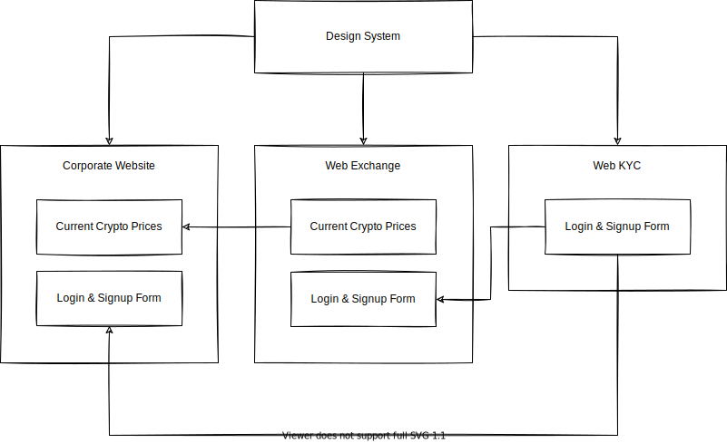

# Micro-frontend Architecture

Simple demo of how micro-frontend architecture works.



## Quick Setup

1.  Install all dependencies.

    ```bash
    npm install
    ```

2.  Start the development servers.

    ```bash
    npm start
    ```
